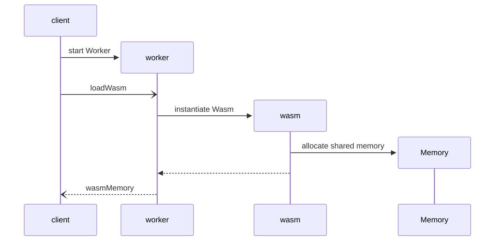
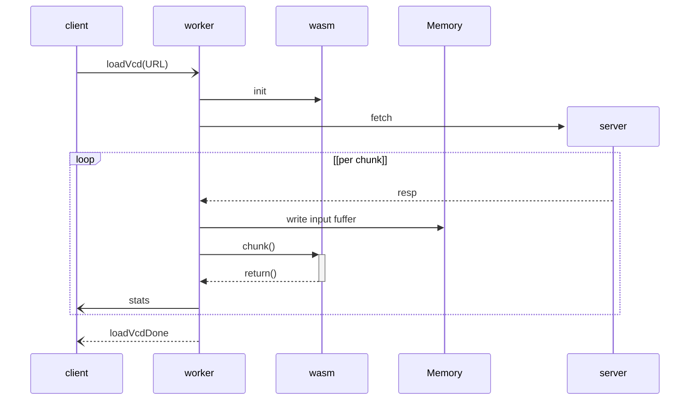

### Initialization

```mermaid
sequenceDiagram
  participant C as client
  create participant W as worker
  C->>W : start Worker
  C-)W : loadWasm
  create participant A as wasm
  W->>A : instantiate Wasm
  create participant M as Memory
  A->>M : allocate shared memory
  A-->>W : 
  W--)C : wasmMemory
```

### loadVcd

```mermaid
sequenceDiagram
  participant C as client
  participant W as worker
  participant A as wasm
  participant M as Memory
  C-)W : loadVcd(URL)
  W->>A : init
  create participant S as server
  W->>S : fetch
  loop [per chunk]
    S-->>W : resp
    W->>M : write input fuffer
    W->>+A : chunk()
    A-->>-W: return()
    W-)C : stats
  end
  W--)C : loadVcdDone
```
